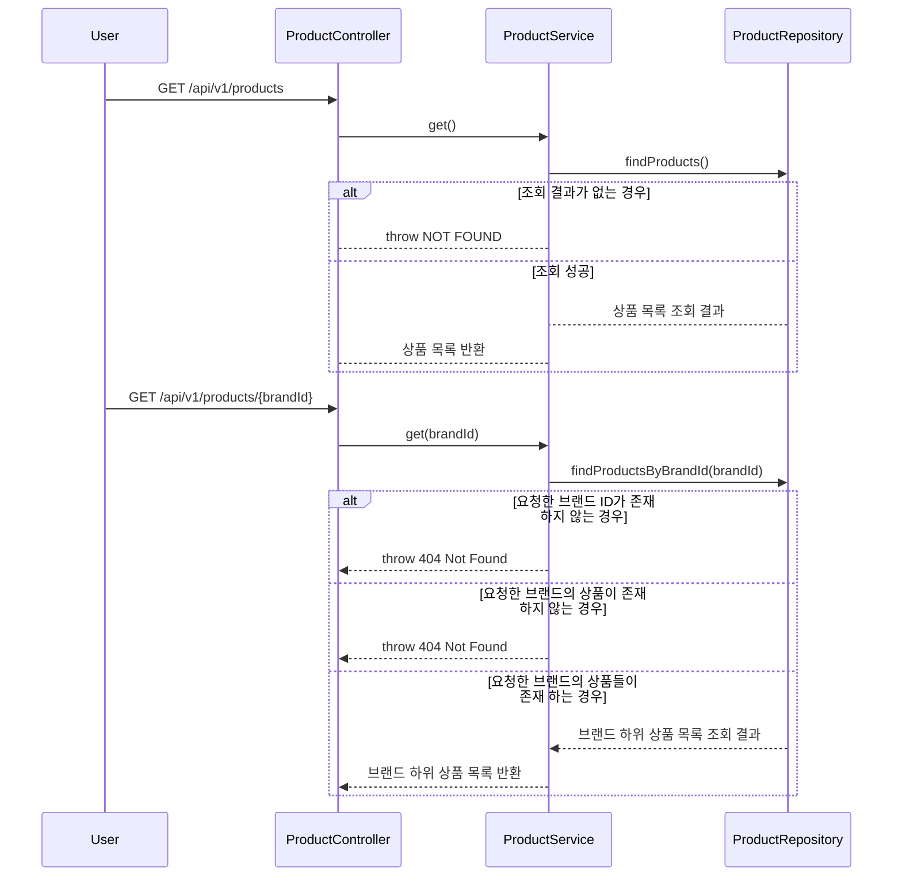
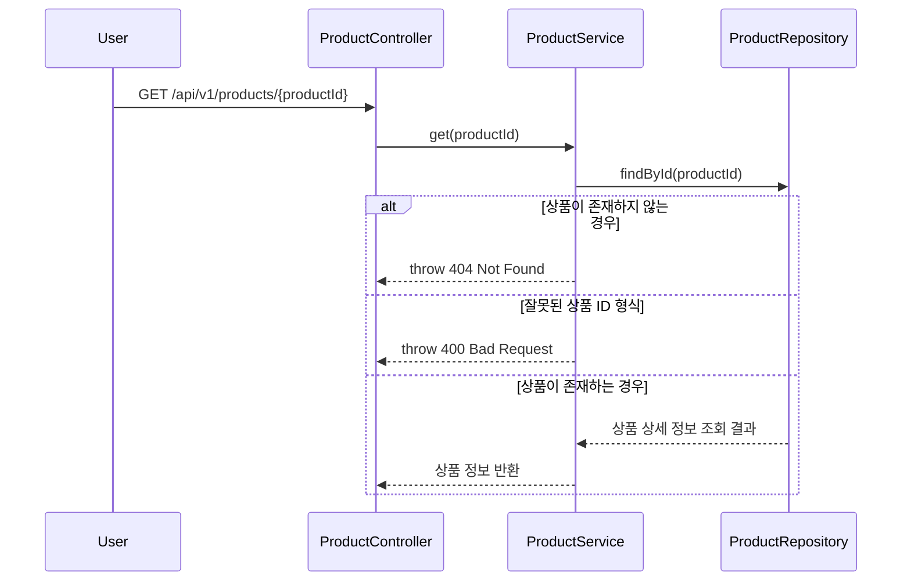
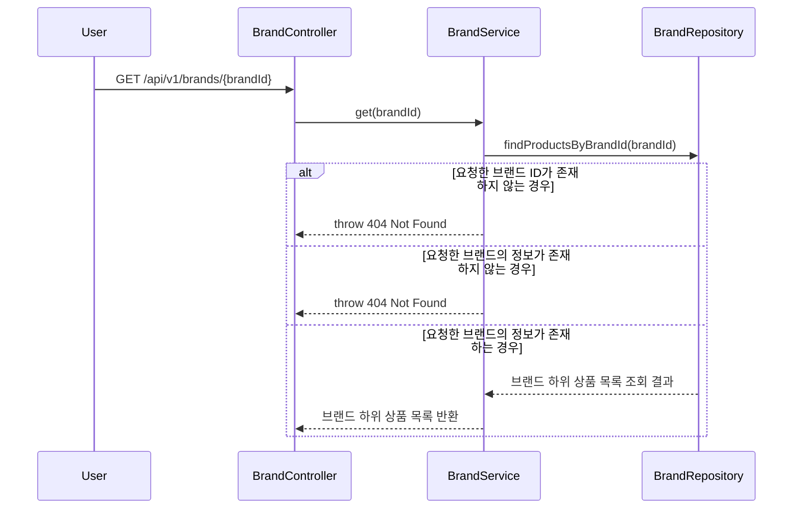
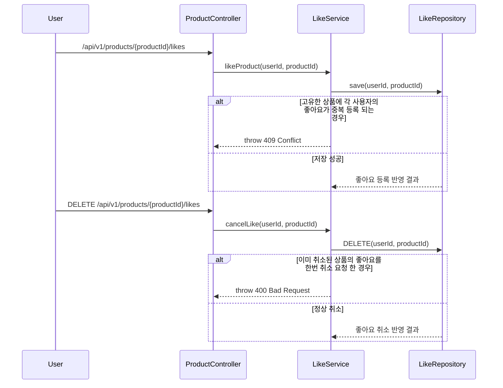
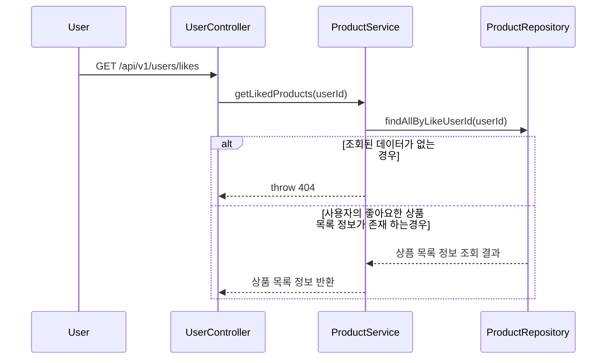
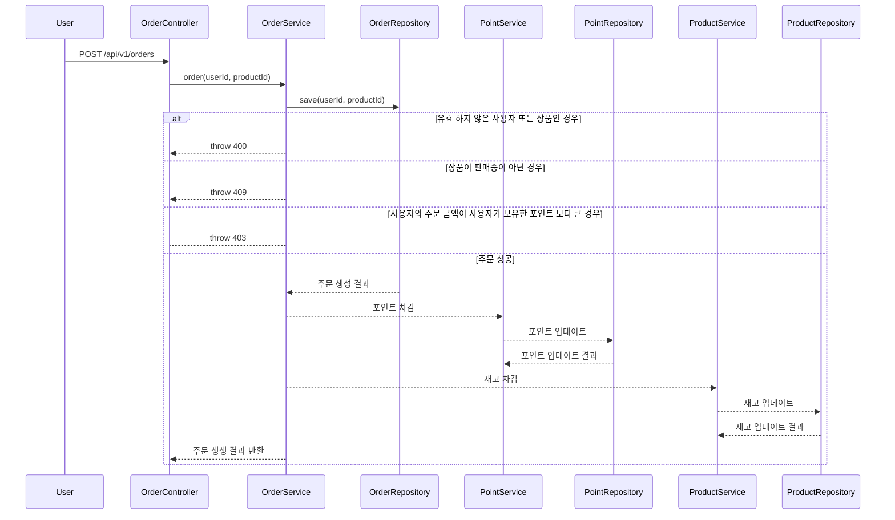
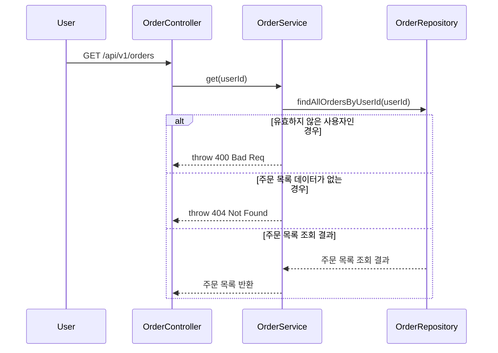
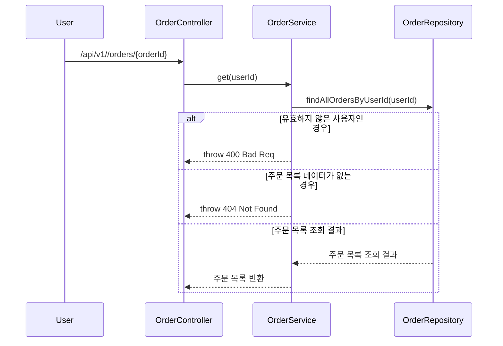

# 시퀀스다이어그램

## 상품

### 상품 목록 조회

```mermaid
sequenceDiagram
    participant U  as User
    participant PC as ProductController
    participant PS as ProductService
    participant PR as ProductRepository


U ->> PC : GET /api/v1/products
PC ->> PS : get()
PS ->> PR : findProducts()
alt 조회 결과가 없는 경우 
    PS --> PC : throw NOT FOUND
    else 조회 성공
    PR --> PS : 상품 목록 조회 결과
    PS --> PC : 상품 목록 반환
end

    U ->>PC: GET /api/v1/products/{brandId}
    PC ->> PS: get(brandId)
    PS ->> PR: findProductsByBrandId(brandId)
    alt 요청한 브랜드 ID가 존재 하지 않는 경우
        PS -->> PC: throw 404 Not Found
    else 요청한 브랜드의 상품이 존재 하지 않는 경우
        PS -->> PC : throw 404 Not Found
    else 요청한 브랜드의 상품들이 존재 하는 경우
        PR -->> PS : 브랜드 하위 상품 목록 조회 결과
        PS -->> PC : 브랜드 하위 상품 목록 반환
    end

```

### 상품 상세 조회

```mermaid
sequenceDiagram
    participant U as User
    participant PC as ProductController
    participant PS as ProductService
    participant PR as ProductRepository

    U ->>PC: GET /api/v1/products/{productId}
    PC->>PS: get(productId)
    PS->>PR: findById(productId)
    alt 상품이 존재하지 않는 경우
        PS -->> PC: throw 404 Not Found
    else 잘못된 상품 ID 형식
        PS -->> PC: throw 400 Bad Request
    else 상품이 존재하는 경우
        PR -->> PS: 상품 상세 정보 조회 결과
        PS -->> PC: 상품 정보 반환
    end

   
    
```

---

### 브랜드

```mermaid
sequenceDiagram
    participant U as User
    participant BC as BrandController
    participant BS as BrandService
    participant BR as BrandRepository

    U ->>BC: GET /api/v1/brands/{brandId}
    BC ->> BS: get(brandId)
    BS ->> BR: findProductsByBrandId(brandId)
    alt 요청한 브랜드 ID가 존재 하지 않는 경우
        BS -->> BC: throw 404 Not Found
    else 요청한 브랜드의 정보가 존재 하지 않는 경우
        BS -->> BC : throw 404 Not Found
    else 요청한 브랜드의 정보가 존재 하는 경우
        BR -->> BS : 브랜드 하위 상품 목록 조회 결과
        BS -->> BC : 브랜드 하위 상품 목록 반환
    end
```

---

### 좋아요

### 좋아요 등록 / 취소

```mermaid
sequenceDiagram
    participant U as User
    participant PC as ProductController
    participant LS as LikeService
    participant LR as LikeRepository
    
    U ->> PC :/api/v1/products/{productId}/likes
    PC ->> LS : likeProduct(userId, productId)
    LS ->> LR : save(userId, productId)
    alt 고유한 상품에 각 사용자의 좋아요가 중복 등록 되는 경우 
        LS -->> PC : throw 409 Conflict
        else 저장 성공
        LR -->> LS : 좋아요 등록 반영 결과
    end
    
    U ->> PC : DELETE /api/v1/products/{productId}/likes
    PC ->> LS : cancelLike(userId, productId)
    LS ->> LR : DELETE(userId, productId)
    alt 이미 취소된 상품의 좋아요를 한번 취소 요청 한 경우  
        LS -->> PC : throw 400 Bad Request
        else 정상 취소
        LR -->> LS : 좋아요 취소 반영 결과
    end

```

### 내가 좋아요한 상품 목록 조회

```mermaid
sequenceDiagram
    participant U as User
    participant UC as UserController
    participant PS as ProductService
    participant PR as ProductRepository
    
    U ->> UC : GET /api/v1/users/likes
    UC ->> PS : getLikedProducts(userId)
    PS ->> PR : findAllByLikeUserId(userId)
    
    alt 조회된 데이터가 없는 경우
        PS -->> UC  : throw 404 
        else 사용자의 좋아요한 상품 목록 정보가 존재 하는경우
        PR -->> PS : 상픔 목록 정보 조회 결과
        PS -->> UC : 상품 목록 정보 반환
    end

```

---

## 주문

### 주문 요청

```mermaid
sequenceDiagram
    participant U as User
    participant OC as OrderController
    participant OS as OrderService
    participant OR as OrderRepository
    participant POS as PointService
    participant POR as PointRepository
    participant PRS as ProductService
    participant PRR as ProductRepository
    
    U ->> OC : POST /api/v1/orders
    OC ->> OS : order(userId, productId)
    OS ->> OR : save(userId, productId)
    
    alt 유효 하지 않은 사용자 또는 상품인 경우 
    OS -->> OC : throw 400 
    else 상품이 판매중이 아닌 경우
    OS -->> OC : throw 409
    else 사용자의 주문 금액이 사용자가 보유한 포인트 보다 큰 경우 
    OS --> OC : throw 403
    else 주문 성공
    OR -->> OS : 주문 생성 결과
    OS -->> POS : 포인트 차감
    POS -->> POR : 포인트 업데이트
    POR -->> POS : 포인트 업데이트 결과
    OS -->> PRS : 재고 차감
    PRS -->> PRR : 재고 업데이트
    PRR -->> PRS : 재고 업데이트 결과
    OS -->> OC : 주문 생생 결과 반환
    end
```

### 주문 목록 조회 

```mermaid
sequenceDiagram
    participant U as User
    participant OC as OrderController
    participant OS as OrderService
    participant OR as OrderRepository
    
    U ->> OC :  GET /api/v1/orders
    OC ->> OS : get(userId)
    OS ->> OR : findAllOrdersByUserId(userId)
    
    alt 유효하지 않은 사용자인 경우 
        OS -->> OC : throw 400 Bad Req
        else 주문 목록 데이터가 없는 경우
        OS -->> OC : throw 404 Not Found
        else 주문 목록 조회 결과
        OR -->> OS : 주문 목록 조회 결과
        OS -->> OC : 주문 목록 반환
    end
```

### 주문 상세 조회

```mermaid
sequenceDiagram
    participant U as User
    participant OC as OrderController
    participant OS as OrderService
    participant OR as OrderRepository
    
    U ->> OC :  /api/v1//orders/{orderId}
    OC ->> OS : get(userId)
    OS ->> OR : findAllOrdersByUserId(userId)
    
    alt 유효하지 않은 사용자인 경우 
        OS -->> OC : throw 400 Bad Req
        else 주문 목록 데이터가 없는 경우
        OS -->> OC : throw 404 Not Found
        else 주문 목록 조회 결과
        OR -->> OS : 주문 목록 조회 결과
        OS -->> OC : 주문 목록 반환
    end

```