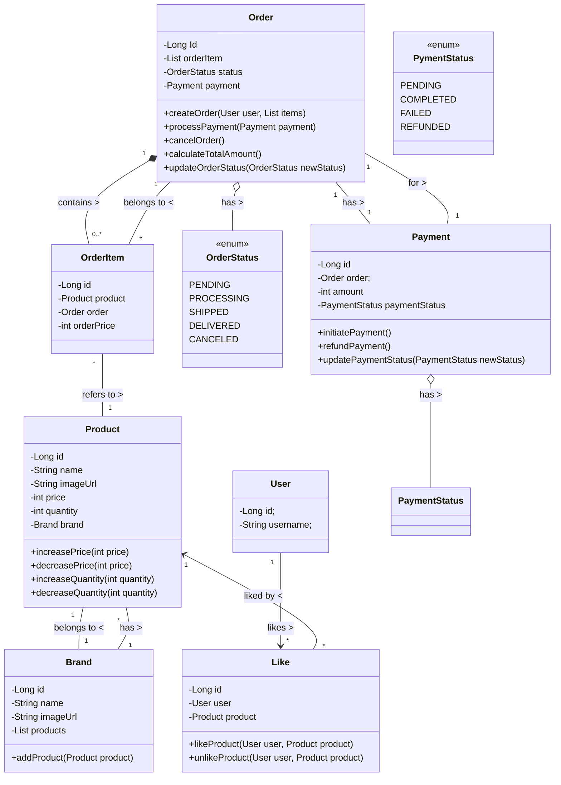

# 도메인 객체 설계 class-diagrams 

```mermaid
classDiagram
    class User {
        -Long id;
        -String username;
    }
    
    class Product {
        -Long id
        -String name
        -String imageUrl
        -int price
        -int quantity
        -Brand brand
        
        +increasePrice(int price)
        +decreasePrice(int price)
        +increaseQuantity(int quantity)
        +decreaseQuantity(int quantity)
    }
    class Brand {
        -Long id
        -String name
        -String imageUrl
        -List<Product> products
        
        +addProduct(Product product)
    }
    
    class Like{
        -Long id
        -User user
        -Product product
        
        +likeProduct(User user, Product product)
        +unlikeProduct(User user, Product product)
        
            
    }
    
     class Order{
         -Long Id
         -List<OrderItem> orderItem
         -OrderStatus status
         -Payment payment
         
         +createOrder(User user, List<OrderItem> items)
         +processPayment(Payment payment)
         +cancelOrder()
         +calculateTotalAmount()
         +updateOrderStatus(OrderStatus newStatus)
     }
     class OrderItem {
         -Long id
         -Product product
         -Order order
         -int orderPrice
     }
     
     class OrderStatus {
         <<enum>>
         PENDING
         PROCESSING
         SHIPPED
         DELIVERED
         CANCELED
     }
     
     class Payment {
         -Long id
         -Order order;
         -int amount
         -PaymentStatus paymentStatus
         
         +initiatePayment()
         +refundPayment()
         +updatePaymentStatus(PaymentStatus newStatus)
     }
     
     class PymentStatus {
         <<enum>>
         PENDING
         COMPLETED
         FAILED
         REFUNDED
     }
    Brand "1" -- "*" Product : has > 
    Product "1" -- "1" Brand : belongs to < 

    Order "1" *-- "0..*" OrderItem : contains > 
    OrderItem "*" -- "1" Product : refers to > 
    OrderItem "*" -- "1" Order : belongs to < 

    Order "1" -- "1" Payment : has >
    Payment "1" -- "1" Order : for >

    Payment o-- PaymentStatus : has > 
    Order o-- OrderStatus : has > 

    User "1" --> "*" Like : likes >
    Product "1" <-- "*" Like : liked by <


    
    
    
```

