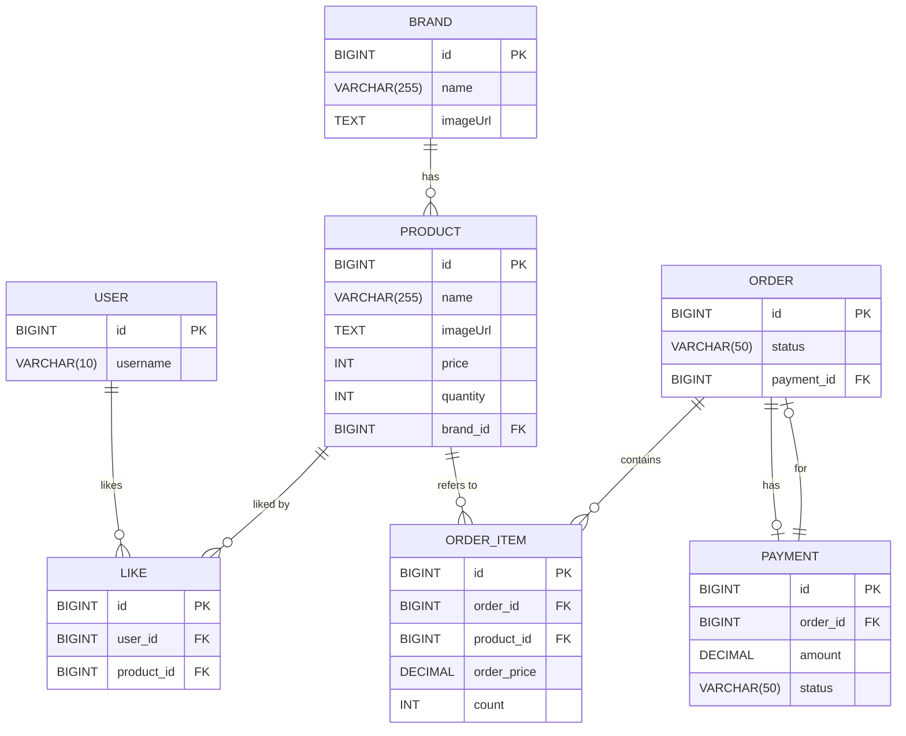

```mermaid
erDiagram
    USER {
        BIGINT id PK
        VARCHAR(10) username
    }

    BRAND {
        BIGINT id PK
        VARCHAR(255) name
        TEXT imageUrl
    }

    PRODUCT {
        BIGINT id PK
        VARCHAR(255) name
        TEXT imageUrl
        INT price
        INT quantity
        BIGINT brand_id FK 
    }

    ORDER {
        BIGINT id PK
        VARCHAR(50) status  
        BIGINT payment_id FK 
    }

    ORDER_ITEM {
        BIGINT id PK
        BIGINT order_id FK 
        BIGINT product_id FK 
        DECIMAL order_price 
        INT count 
    }

    PAYMENT {
        BIGINT id PK
        BIGINT order_id FK 
        DECIMAL amount 
        VARCHAR(50) status 
    }

    "LIKE" {
        BIGINT id PK
        BIGINT user_id FK 
        BIGINT product_id FK 
%%        "UNIQUE (user_id, product_id)" "사용자별 상품 좋아요 유니크"

}

    USER ||--o{ LIKE : "likes"
    PRODUCT ||--o{ LIKE : "liked by"

    BRAND ||--o{ PRODUCT : "has"

    "ORDER" ||--o{ ORDER_ITEM : "contains"
    PRODUCT ||--o{ ORDER_ITEM : "refers to"

    "ORDER" ||--o| PAYMENT : "has"
    PAYMENT ||--o| "ORDER" : "for"
```