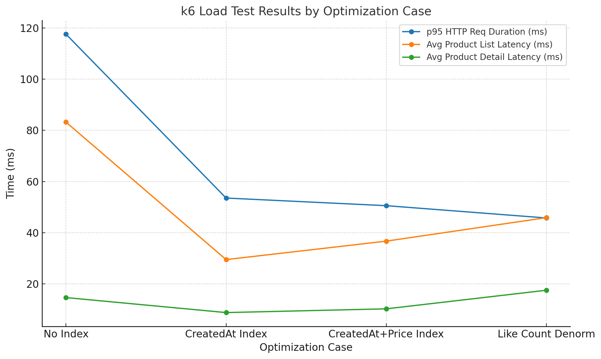

## 1. **상품 테이블 인덱스 없음**

- **p95 응답 시간**: 117.53ms

- **product_list_latency 평균**: 83.18ms

- 전체 요청 중 **상세 조회**(product_detail)는 평균 14.65ms, **목록 조회**는 평균 83.18ms로 목록 쿼리가 병목임이 보임.

- 부하 환경: **10 VUs** → 35.88 req/s

**특징**: 목록 쿼리의 응답 시간이 길고(최대 228ms), 전체 성능이 가장 낮음.

---

## 2. **상품 생성시간 인덱스 추가**

- **p95 응답 시간**: 53.53ms (약 54% 성능 개선)

- **product_list_latency 평균**: 29.49ms (약 64% 단축)

- 상세 조회 평균: 8.79ms → 상세 조회도 다소 빨라짐.

- 부하 환경: **20 VUs** → 38.37 req/s

**특징**: 목록 조회 쿼리 속도가 크게 개선됨. 인덱스 추가로 읽기 효율이 높아져 전체 응답 속도가 절반 이하로 감소.

---

## 3. **상품 생성시간 + 가격 인덱스 추가**

- **p95 응답 시간**: 50.55ms (약간 추가 개선)

- **product_list_latency 평균**: 36.69ms (오히려 2번보다 소폭 악화)

- 상세 조회 평균: 10.25ms (약간 느려짐)

- 부하 환경: **10 VUs** → 19.07 req/s (테스트 VU 수가 줄었으므로 단순 비교는 불가)

**특징**: 응답 시간은 소폭 개선이지만, 평균 목록 조회 속도는 오히려 약간 떨어짐. 이는 VU 수와 쿼리 실행 계획 변화의 영향 가능성 있음.

---

## 4. **상품 좋아요 카운트 비정규화**

- **p95 응답 시간**: 45.75ms (가장 빠름)

- **product_list_latency 평균**: 45.87ms (평균은 2번보다 느리지만, p95 기준 가장 안정적)

- 상세 조회 평균: 17.51ms (상세 조회는 2번보다 느림)

- 부하 환경: **10 VUs** → 18.78 req/s

**특징**: 좋아요 카운트를 join 없이 가져오도록 비정규화한 결과, 목록 조회의 **최대 지연(p95)**이 가장 짧아져 응답이 안정적임. 하지만 평균 latency는 2번보다 다소 길어짐.

---

## 종합 결론

1. **인덱스 추가 효과**:

    - 생성시간 인덱스만 추가한 2번 케이스에서 가장 큰 개선 효과가 있었음.

    - 가격 인덱스까지 추가했을 때는 쿼리 계획 변화로 오히려 평균 응답이 약간 느려질 수 있음.

2. **비정규화 효과**:

    - 좋아요 카운트 비정규화는 쿼리의 일관된 응답 속도를 확보(p95 최소)하는 데 효과적이었음.

    - 단, 상세 조회 속도는 조금 손해.

3. **권장 접근**:

    - **목록 조회**: 생성시간 인덱스 + 필요한 경우 비정규화를 병행해 p95 안정화.

    - **상세 조회**: 현재 속도 충분히 빠르지만, 좋아요 카운트 join 제거가 없다면 더 빨라질 여지 있음.

